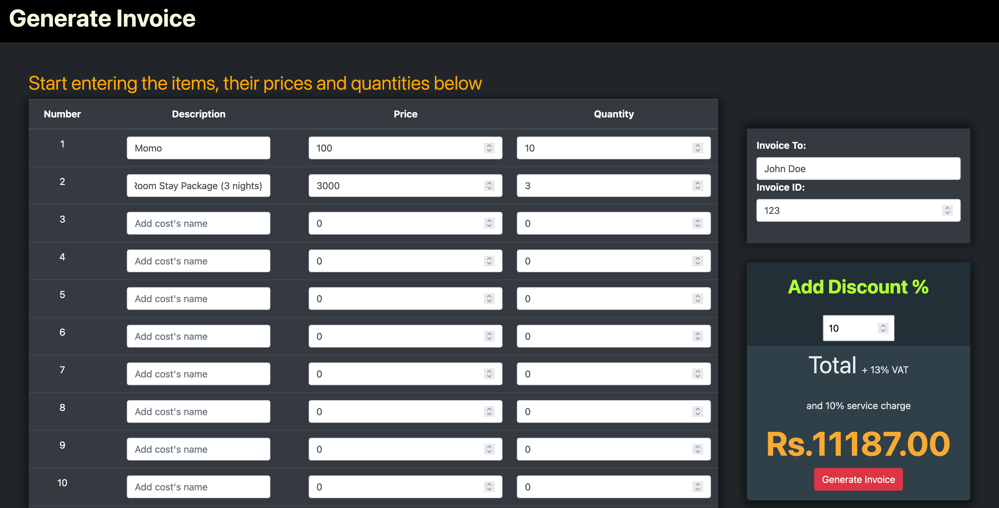
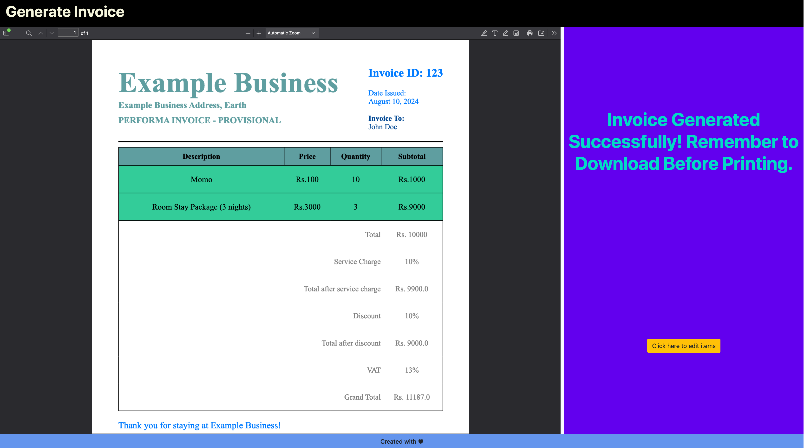

# Flask PDF Invoices

A simple Flask web application for generating PDF invoices. This project allows users to enter all costs for a bill through the website, add discounts, and then finally generate a PDF invoice.

## Usage

1. **Clone the repository:**

   `git clone https://github.com/safalbaral/Invoice-Generator-Flask.git`

   `cd billing_system`

2. **Install the required dependencies:**

   `pip install -r requirements.txt`

## Configuration

1. **In your `.bashrc` or `.zshrc` file** export a `FLASK_SECRET_KEY` variable with a secret key.

2. **Replace the invoice details in invoice.html and invoice.css** according to your needs. There are commented lines with 'REPLACE' that you can easily search for.

## Usage

1. **Run the Flask application:**

   `python run.py`

2. **Navigate to `http://127.0.0.1:5000`** in your web browser to access the application.

3. **Create an invoice:**
   - Fill out the form with the invoice details.
   - Click "Generate Invoice" to create and download the invoice.
